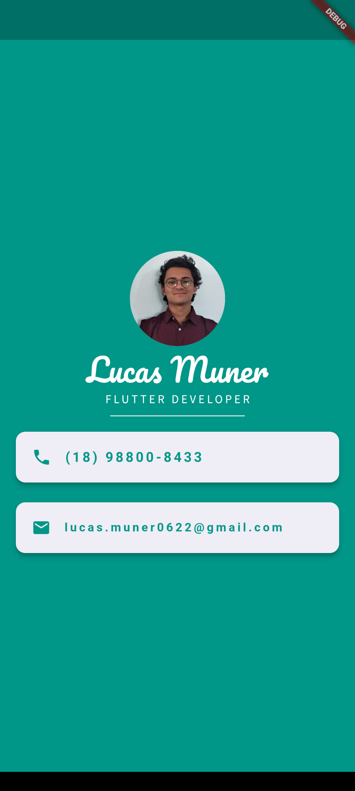

# Informações Pessoais - Projeto Flutter

Este projeto consiste em uma tela simples desenvolvida em Flutter, que exibe informações pessoais, como e-mail e telefone, demonstrando a manipulação de vários widgets disponíveis no Flutter, como Columns, Cards, ListTiles, CircleAvatar, Icons, entre outros.

## Capturas de tela

## Recursos e Widgets Utilizados

- **Container**: Utilizado para organizar os elementos na vertical.
- **Cards**: Utilizado para exibir as informações pessoais em cartões individuais.
- **ListTiles**: Utilizado para exibir informações como e-mail e telefone.
- **CircleAvatar**: Utilizado para exibir uma imagem circular do usuário.
- **Icons**: Utilizado para exibir ícones de e-mail e telefone.
- **Outros Widgets**

## Como Executar

1. Certifique-se de ter o ambiente de desenvolvimento Flutter configurado corretamente em seu sistema.
2. Clone este repositório.
3. Abra o projeto em seu editor de código preferido.
4. Execute `flutter pub get` para instalar as dependências.
5. Conecte um dispositivo ou inicie um emulador.
6. Execute `flutter run` para iniciar o aplicativo.

## Autor

Lucas Muner Garcia
